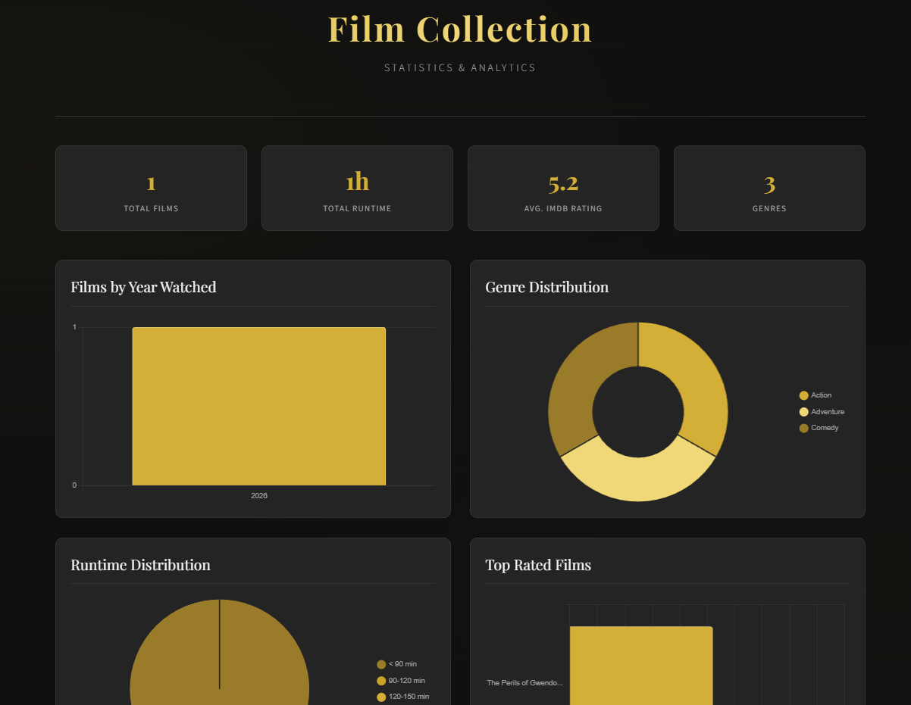

frt
=========

frt is a C# console application to store film information and generate static HTML page charting that information.



## Download

Compiled downloads are not available.


## Compiling

To clone and run this application, you'll need [Git](https://git-scm.com) and [.NET](https://dotnet.microsoft.com/) installed on your computer. From your command line:

```
# Clone this repository
$ git clone https://github.com/btigi/frt

# Go into the repository
$ cd src

# Build  the app
$ dotnet build
```

## Licencing

frt is licenced under the MIT License. Full licence details are available in licence.md
